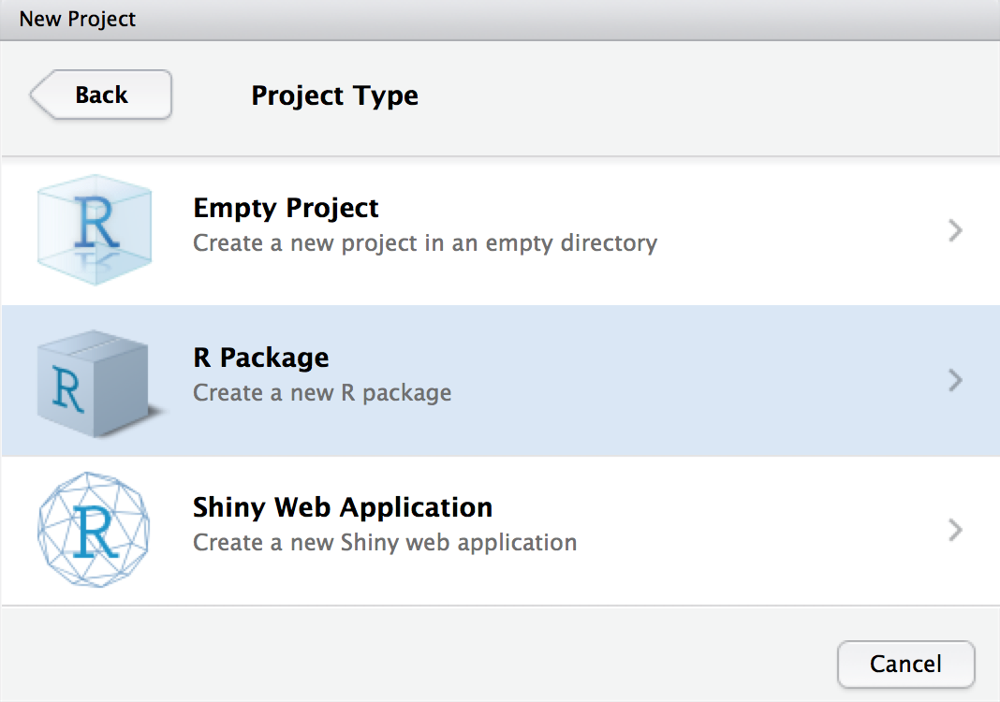
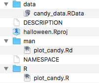
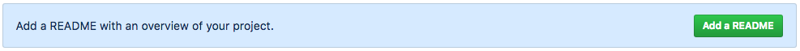
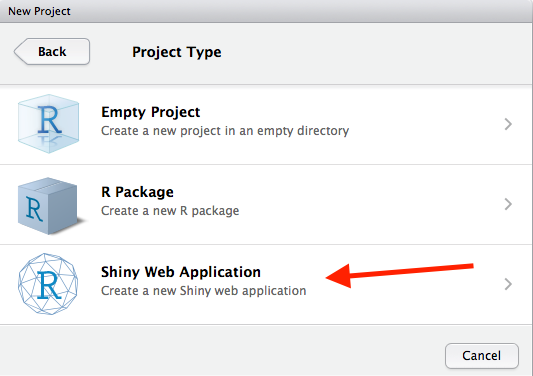

# Advanced Data Science - R Products Tutorial

This tutorial is designed for students enrolled in the JHSPH Biostat Department required course "Advanced Data Science."  In this tutorial, we will

1) build an R package from scratch,
2) create a website for the R package using GitHub Pages, and 
3) build a Shiny app, which will use the R package we create!

Slides describing overviews of these R products are available *here* (include link to slides when they are written...)

The theme of this tutorial is **Halloween candy**! :jack_o_lantern: :candy: Using data from [this FiveThirtyEight blogpost](https://fivethirtyeight.com/features/the-ultimate-halloween-candy-power-ranking/), we will be building an R package and an accompanying Shiny app that visualizes the most popular candies (the rankings are done according to a series of pair-wise comparisons between candies - see the original blogpost for more details). 

----------

## Create an R package

First, we will build an R package that creates a barplot of the top-ranked candies using `ggplot2` and push it to GitHub.  

#### 1. Create a new R project in RStudio
Let's start by creating a new local folder with an R package project:
1) Open RStudio and select "New R Project" in the drop down menu in the top right corner of the window
2) Select "New Directory"
3) Select "R Package"
4) Name your R package **halloween** (which will also be the name of the local folder housing the R package), and specify where you want this new directory to live locally. *Make sure that "Create a git repository" is selected!*



#### 2. Create a new GitHub repo
Create a GitHub repository online and link it to the local directory of the R project.  You can do so by following the steps in [this GitHub help page](https://help.github.com/articles/adding-an-existing-project-to-github-using-the-command-line/), or by following these condensed steps: 

1) Log in to GitHub and create a new repo called "halloween" (do *not* add a `README` or a .gitignore)
2) Open a new Terminal/Git Bash console on your computer and make your way into your local "halloween" directory.
3) Edit the code chunk below according to your own GitHub username, and then paste it line by line into the terminal (if you forgot to select "Create a git repository" when making your R project, don't worry!  Before you enter the code below, run `git init` to initialize the repo):

```
git add .
git commit -m "first commit"
git remote add origin git@github.com:[USERNAME]/halloween.git
git push -u origin master
```

Double check on the GitHub website to verify that the files have been pushed!

#### 3. Download data for the R package
Keep the terminal window open and in the "halloween" directory.  Let's download the data that we'll be using!  In order to actually attach the data file to the R package, we will need to save the data locally as a .RData file in the `data/` folder.  I've written an R script (found [here](https://github.com/benjamin-ackerman/R_products_tutorial/blob/master/1_R_package/download_data.R)) that does the following:

1) Reads in the .csv file from FiveThirtyEight's GitHub Repo into R
2) Saves the data frame as a .RData object in the `data/` directory of the package.

You can either copy and paste the code from GitHub and run it manually in RStudio, or you can download and run the `download_data.R` script by following code into the command line:

```
mkdir data
curl https://raw.githubusercontent.com/benjamin-ackerman/R_products_tutorial/master/1_R_package/download_data.R > download_data.R
Rscript download_data.R
```

Let's break down what the code above does!

1) `mkdir` creates a new directory within "halloween" called "data"
2) `curl` reads the R script from this repo
3) `>` funnels the output into a local file on your computer called 'download_data.R'. *A note for PC users:* you may need to use `wget` instead of `curl`
4) `Rscript` executes the script `download_data.R` from the command line

Now check to make sure there's a file called `candy_data.RData` in your local `data/` folder!  If you downloaded the R script `download_data.R`, you can remove it now from your project folder (run `rm download_data.R` into the terminal console).

#### 4. Add the necessary R function to the package
Our "halloween" R package will contain one function: `plot_candy`.  This will take in a data frame, the number of top candies to plot, and the names of the columns specifying the candy name and ranking, and will produce a barplot from `ggplot` with the top ranked candies.

The script containing the `plot_candy` function is *already written* and can be found [here](https://github.com/benjamin-ackerman/R_products_tutorial/blob/master/1_R_package/plot_candy.R).  Again, you can either copy and paste the code from GitHub into a new R script in the "R" folder called "plot_candy.R", or you can run the following code in the terminal to automatically download the code:

```
curl https://raw.githubusercontent.com/benjamin-ackerman/R_products_tutorial/master/1_R_package/plot_candy.R > R/plot_candy.R
```

Just like when we downloaded the data above, `curl` reads the R script from GitHub, and `>` saves the output into a script located in your local `R/` folder.

**Optional:** If you would like to also get rid of the "hello.R" function, you can also do so from the command line by entering the following:

```
rm R/hello.R
rm man/hello.Rd
```

Check to make sure that the script `plot_candy.R` is in the `R/` directory of your project's folder.

#### 5. Add documentation and build package
Now that the R function and the data are added to the project, it's time to add documentation!

First, let's add documentation for the `plot_candy` function.  Notice that in the beginning of the `plot_candy.R` script, there is a section of code where every line starts with `#'`.  This section of the code actually *contains* the documentation for the function - all we have to do is generate the `.Rd` file in the "man" directory!  In RStudio, we will follow these steps:

1) Load the `devtools` package
2) Run the following code in the R console: `devtools::document()`

There should now be a file in the `man/` folder called "plot_candy.Rd" (there will also be some code added to the 'NAMESPACE' file, but don't worry about that for now).

Next, let's add documentation for the package in the 'DESCRIPTION' file:

1) Open the 'DESCRIPTION' file (either in RStudio or your preferred text editor)
2) Add a title, your name, and a short description of the package in the appropriate fields
3) Add the following chunk of code at the end of the file to make sure that the necessary R packages are imported:

```
Imports:
    dplyr,
    ggplot2
```

It's now time to **test and build the package!**  To do so, run the following command in RStudio:

```
devtools::check(document = FALSE)
```

If there are 0 errors, then you can build the package by pressing `Command` + `Shift` + `B`.  The "halloween" package should now be loaded and functional!

#### 6. Push the R Package to GitHub!
At this point, your "halloween" local folder should have all of the following files:



Now that all of the package necessities are complete, it's time to push the package to GitHub, so that it can be downloaded by its future users.  There are two ways to do this: in RStudio (in the 'Git' panel), or in the terminal.

To push the package to GitHub in the terminal, execute the following commands:

```
git add .
git commit -m 'halloween package is functional'
git push
```

You have now successfully created an R package and pushed it to GitHub! :tada: You can go ahead and close the project now.

----------

## Make a website for your R package
Now that we have created our R package, we can create a webpage for it using **GitHub pages**.  GitHub Pages takes the `README` of a repo and generates a website from it.  Websites for R packages can be incredibly useful for highlighting features of a package and for easily marketing the package to its potential users.  We'll now walk through the steps to creating a webpage for our "halloween" R package:

#### 1. Add a README.md
You may have noticed that our R package's repo thus far does not have a `README`. `README` files are *super* important to include with any repo in order to inform readers of any details they should know for installing/using/modifying your code.  At the bottom of the repo's `Code` page, you'll notice an option to create a `README` for your repo:  



There are two ways to go about adding a `README` file.  The first is to click on this button, manually type in the text, and click "Commit new file."  The other option is to create a new `.md` file locally in your "halloween" directory, add the new file using git and push it from the command line.  For convenience, you can find a pre-written README for the "halloween" package [here](https://github.com/benjamin-ackerman/R_products_tutorial/blob/master/2_GitHub_pages/package_README.md).

Similar to how we downloaded the code for the R package from this tutorial's repo, we can download and push the `README` as well by running the following code from the command line:

```
curl https://raw.githubusercontent.com/benjamin-ackerman/R_products_tutorial/master/2_GitHub_pages/package_README.md > README.md
git add README.md
git commit -m 'added README'
git push
```

*NOTE*: once you download the `README`, make sure to replace all occurrences of '[USERNAME]' with your *actual* GitHub username.

#### 2. Turn the README.md into a webpage

Now that you have a `README` file, it's time to turn it into a webpage!

1. On GitHub, go to the "halloween" repo settings
2. Under the section "GitHub Pages," select "master branch" as the source and then click "Save"
3. Choose a theme for your website

By following the steps above, you will generate an additional file in your repo called `_config.yml`, which specifies how to format your webpage (according to the theme you choose).  

Your webpage for your "halloween" package should now be live! Note that it may take a few minutes for the theme to actually load.  You can access your website now at the following url:

```
https://[USERNAME].github.io/halloween/
```

----------

## Make a Shiny app using your R package

Last but not least, it's time to make a Shiny app to visualize the halloween candy ranking data!  Shiny apps are great tools that allow users to explore and interact with data with ease.  We're going to use the "halloween" R package to make an app where users can visualize the top-ranked candies by different candy characteristics (i.e. flavor, candy form, etc).  

#### 1. Create an R Shiny Project
Similar to when we created the R Project for the "halloween" package, we will now create a new project for this Shiny app:

1) Open RStudio and select "New R Project" in the drop down menu in the top right corner of the window
2) Select "New Directory"
3) Select "Shiny Web Application"



4) Name your Shiny app **candy_vis** (which will also be the name of the local folder housing the Shiny app files), and specify where you want this new directory to live locally.

You'll notice that two files were created in this new project directory: `ui.R` and `server.R`.  `ui.R` will define how the web app appears to the user (i.e. the title, content, and fields for users to make inputs/selections).  `server.R` will define the objects that get included on the web app's page, which are *reactive* to the user's inputs (i.e. plots, text).

I have created `server.R` and `ui.R` scripts that we will use to generate the Shiny app.  They can be found [here](https://github.com/benjamin-ackerman/R_products_tutorial/tree/master/3_R_shiny).

#### 2. Install the "halloween" package
Since we will be using our new "halloween" package, we will have to first download it from our respective GitHub repos!

1. Load the `devtools` package in R 

```
library(devtools)
```

2. Install the package using the `install_github()` function (don't forget to insert your GitHub username below!)

```
devtools::install_github("[USERNAME]/halloween")
```

#### 3. Fill in the `ui.R` and `server.R` scripts
