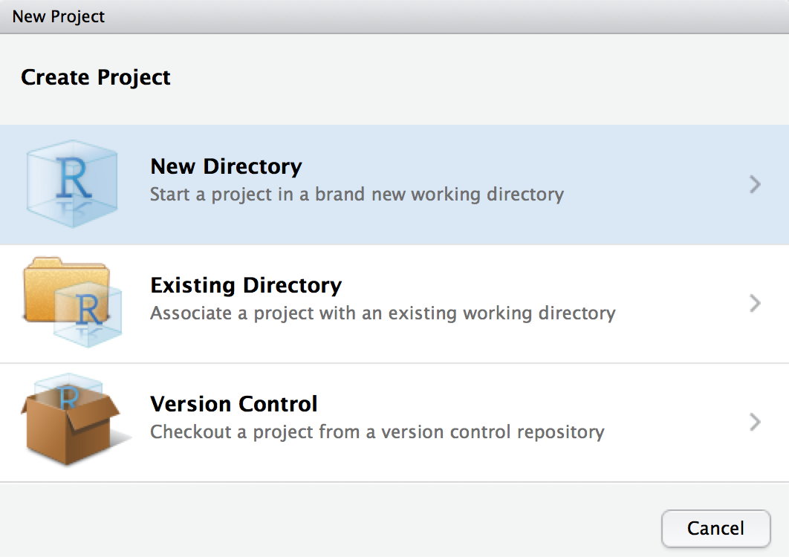

# Advanced Data Science - R Products Tutorial

This tutorial is designed for students enrolled in the JHSPH Biostat Department required course "Advanced Data Science."  In this tutorial, we will 1) build an R package from scratch, 2) create a website for the R package using GitHub Pages, and 3) build a Shiny app, which will use the R package.  Slides describing overviews of these R products are available *here* (include link to slides...)


The theme of this tutorial is **Halloween candy**!  Using data from [this FiveThirtyEight blogpost](https://fivethirtyeight.com/features/the-ultimate-halloween-candy-power-ranking/), we will be building an R package and an accompanying Shiny app that visualizes the most popular candies (the rankings are done according to a series of pair-wise comparisons between candies - see the original blogpost for more details). 

----------

### 1) R package

First, we will build an R package that creates a barplot of the top-ranked candies using `ggplot2`.  To start, create a new R project in RStudio:

1) Select "New R Project" in the drop down menu in the top right corner of the window
2) Select "New Directory"


3) Select "R Package"


4) Choose a name for your R package (I suggest naming it *halloween*, for simplicity), and specify where you want this new directory to live. *Make sure that "Create a git repository" is selected!*

Let's download the data:

1) Open the terminal and navigate to your directory of choice
2) Run the following command to download the data into a `.csv` file: 
```
curl https://raw.githubusercontent.com/fivethirtyeight/data/master/candy-power-ranking/candy-data.csv > candy_data.csv
```
*PC users may need to use `wget` instead of `curl`*